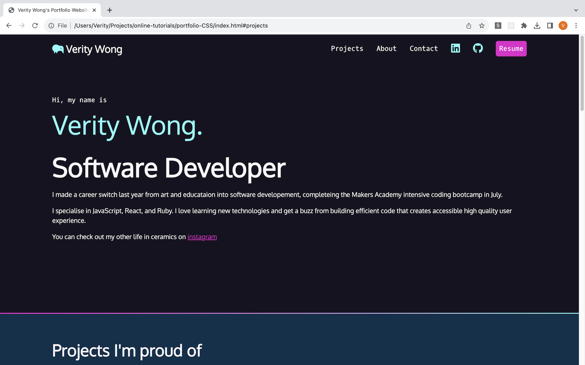
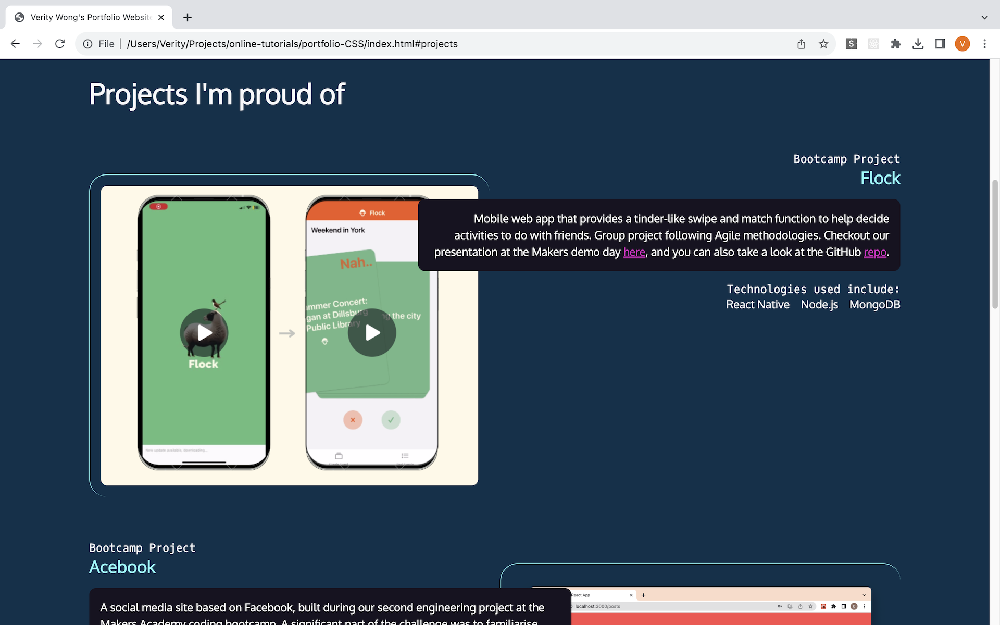
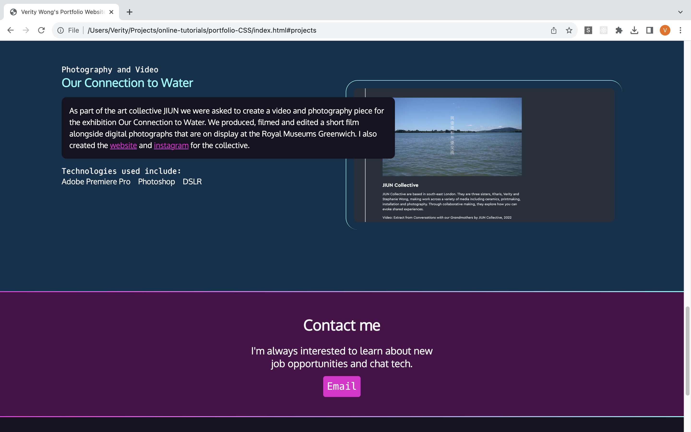

# Portfolio Project

Frontend Masters CSS and HTML course with a focus on high quality HTML element choice and learning the fundamentals of CSS to create an engaging portfolio website.


## Project screenshots




## To open the project in your browser

Go into the root folder and in the command line type:

``` 
open index.html
````