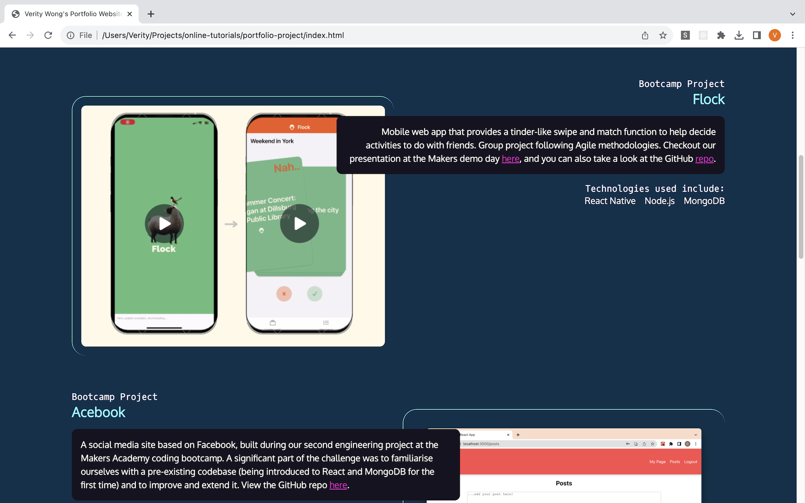

# Portfolio Project

Focus on high quality HTML element choice, learning the fundamentals of CSS and create an engaging portfolio website.


## Project screenshots




## To open the project in your browser

Go into the root folder and in the commande line type:

``` 
open index.html
```